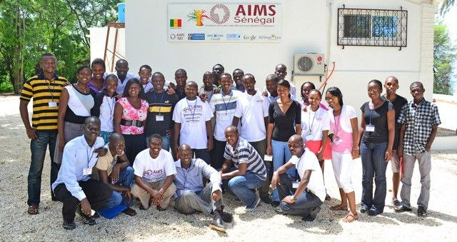
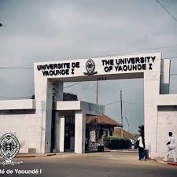
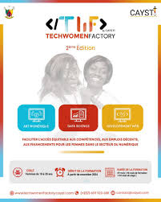

// git add .
//git commit -m "Update README with latest projects and achievements"
//git push origin main

# Data Science & AI Research Portfolio - Danielle Tsemo

This portfolio is a compilation of all the Data Science and AI Research projects I have done for academic, research, and self-learning purposes. It also contains my achievements, skills, certifications, and conference presentations. It is updated on a regular basis.

- **Email**: [nguemtchueng.t.danielle@aims-senegal.org](mailto:nguemtchueng.t.danielle@aims-senegal.org)
- **LinkedIn**: [linkedin.com/in/danielle-tsemo](https://www.linkedin.com/in/danielle-tsemo)
- **GitHub**: [github.com/danielletsemo](https://github.com/danielletsemo)
- **Portfolio**: [nguemtchuengdanielle.github.io/danielletsemo.github.io](https://nguemtchuengdanielle.github.io/danielletsemo.github.io/)

---

## Achievements

- Winner of the JCIA Hackathon 2025 — SafouCheck: African Plum AI Classifier using Computer Vision and Deep Learning.
- 1st Place Lightning Talk at the AfriClimate AI Workshop, Deep Learning Indaba 2024, Senegal.
- Abstract Reviewer at NeurIPS 2024 — WiML (Women in Machine Learning) Workshop.
- Poster Presenter at ACWES 2024 (African Conference of Women Engineers and Scientists), Kigali, Rwanda.
- Best Student in Data Science — TechWomen Factory, CAYSTI Scholarship funded by Global Affairs Canada.
- Master's in Mathematical Sciences (Big Data) — African Institute for Mathematical Sciences (AIMS) Senegal, 2024–2025.

---

## Research Projects

 **[Flood Prediction with LSTM – HYDROAS Project](https://github.com/danielletsemo)**

LSTM-based flood forecasting model for the Ouémé basin in Benin. Processed 30+ years of hydrometeorological data and delivered a 7-day real-time flood prediction pipeline. Results presented at AfriClimate AI and Deep Learning Indaba 2024.

#

 **[Malaria Spread Prediction](https://github.com/danielletsemo)**

Used partial differential equations and neural networks to model and predict the spatial spread of malaria. Applied Scikit-learn and NumPy for feature engineering and model evaluation.

#

 **[Next Word Prediction – NLP](https://github.com/danielletsemo)**

Built a next word prediction system using RNN, LSTM, and Transformer architectures in PyTorch. Evaluated on French and English corpora with a focus on low-resource language adaptation.

#

 **[Handwritten Character Recognition](https://github.com/danielletsemo)**

Implemented a character recognition system using SIFT feature extraction and KNN classification. Tested on handwritten Cameroonian script samples using OpenCV and Scikit-learn.

#

 **[Music Streaming & Recommendation System](https://github.com/danielletsemo)**

Developed a music streaming web application with a collaborative filtering recommendation engine. Built with Python, Flask, and JavaScript; deployed as a full-stack application.

#

 **[Video Auto-Translation for Cameroonian Languages](https://github.com/danielletsemo)**

NLP pipeline for automatic transcription and translation of video content into Cameroonian local languages. Combined speech recognition with custom translation APIs and sequence models.

#

 **[SafouCheck – African Plum AI Classifier](https://github.com/danielletsemo)**

Award-winning project from JCIA Hackathon 2025. A computer vision model that classifies African plum (safou) quality and ripeness using deep learning. Built on a custom African Plums Dataset.

 

---

## Conferences & Certifications

- **WiML Workshop – NeurIPS 2024** · Vancouver, Canada (Online) Abstract Reviewer
- **ACWES 2024** · Kigali, Rwanda — Poster: Hybrid Model for Predicting and Forecasting Floods
- **Deep Learning Indaba 2024** · Senegal Oral: AfriClimate AI Workshop · 1st Place Lightning Talk
- **National Digital Week 2023** · Cameroon  Representative, University of Yaounde 1
- **Data Processing Level 1** · MasterCard Foundation Force N Program — Certification by Global Affairs Canada

---

## Core Competencies

- **Research Areas**: Machine Learning, Deep Learning, NLP, Computer Vision, Time Series Analysis, Flood Forecasting, AI for Climate
- **Languages**: Python (Pandas, NumPy, Scikit-learn, TensorFlow, PyTorch, Keras, OpenCV, Matplotlib), R, SQL, MATLAB, JavaScript
- **Tools**: Git, GitHub, Flask, Tableau, Splunk, MongoDB, MySQL, Hadoop, LaTeX

---

## Education

- **Master's in Mathematical Sciences – Big Data** · AIMS Senegal, Mbour · 2024–2025 *(In Progress)*
- **Master's in Computer Science – Data Science** · University of Yaounde 1 · Completed September 2025
- **Bachelor of Science – Computer Science, Data Science** · University of Yaounde 1 · Completed July 2023
- **Data Scientist Training – CAYSTI Scholarship** · TechWomen Factory · April 2022 – June 2023 · Best Student in Data Science
